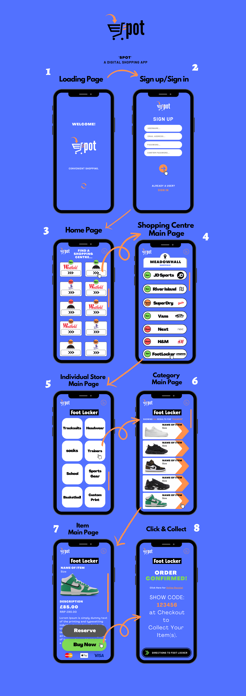

# spotshopper

<h1>Day 1</h1>
<h2>To Do</h2>
To start off this react project I compartmentalized my root folder into two folders, ./client/ and ./server/

then I cd'd into the client subdirectory and executed the following command:
```git
npx create-react-app
```
this generated the files for a basic react web app template, ready to edit and view in a development server in the browser, served on the appropriate port (IE localhost:3000/)

Then, created a new folder in the src directory called pages, where I would create all of the.... Pages.

Each page would be accompanied by its own css file which would have unique styling.


;
